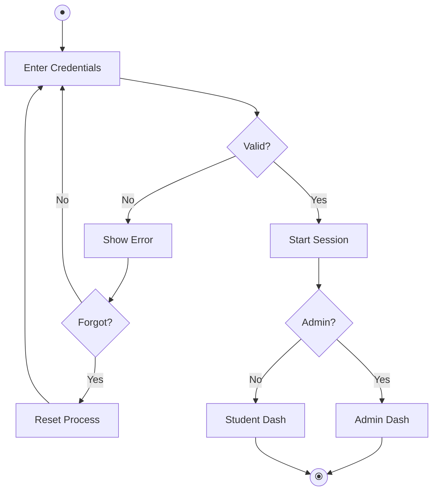

# Activity Diagrams for QuizMaster (Hand-Drawing Guide)

This document provides both visual Mermaid diagrams and detailed step-by-step instructions to help you **hand-draw** the activity diagrams for your project.

---

## 🎨 Symbol Legend for Hand-Drawing

| Symbol | Representation | Hand-Drawing Tip |
| :--- | :--- | :--- |
| **Solid Circle** ● | Start Node | Marks the beginning of the flow. |
| **Bullseye Circle** ⦿ | End Node | Marks the completion of the process. |
| **Rounded Rectangle** | Action/Process | Write the step inside (e.g., "Enter Login Info"). |
| **Diamond** ◆ | Decision Point | Write a question inside. Use arrows for "Yes" and "No". |
| **Arrows** → | Flow Direction | Connects the symbols in order. |
| **Arrow Back** ↺ | Loop/Repeat | An arrow pointing back to a previous action box. |
| **Diamond** ◆ | Decision/Loop | Use this to ask "More questions remaining?". |

---

## 1️⃣ User Authentication Flow (Hand-Drawing Steps)

**Layout Tip:** Draw this from **Top to Bottom**.

1.  **Start**: Draw a **Solid Circle** at the very top.
2.  **Step 1**: Draw a box below it: "**User enters login credentials**".
3.  **Decision 1**: Draw a **Diamond** below the box: "**Credentials valid?**"
    *   **If Yes**: Draw an arrow down to a box: "**Start Session**".
    *   **If No**: Draw an arrow to the right to a box: "**Show Error Message**".
4.  **Decision 2 (From Error)**: Below the Error box, draw a **Diamond**: "**Forgot Password?**"
    *   **If Yes**: Draw a sequence of boxes: "**Enter Email**" → "**Check Reset Link**" → "**Reset Password**". Link the last box back to the first "Login" step.
    *   **If No**: Draw an arrow back to "**User enters login credentials**".
5.  **Role Check**: Below the "Start Session" box, draw a final **Diamond**: "**Is Admin?**"
    *   **Yes path**: Arrow to "**Redirect to Admin Dashboard**" → **End Node**.
    *   **No path**: Arrow to "**Redirect to Student Dashboard**" → **End Node**.

### Visual Reference

---

## 2️⃣ Student Quiz Workflow (Hand-Drawing Steps)

**Layout Tip:** This is a **Long Vertical Flow**.

1.  **Preparation**: Draw boxes for: "**Login**" → "**Browse Catalog**" → "**Select Quiz**".
2.  **Start Quiz**: Draw a box "**Start Quiz (Timer begins)**".
3.  **The Loop**:
    *   Draw an arrow to a box: "**Answer Question**".
    *   Draw another box below it: "**Next Question**".
    *   Draw an arrow from "Next Question" back up to "Answer Question" with a note: "*Repeat for all questions*".
4.  **Submission**: From the loop, draw an arrow to: "**Submit Answers**" → "**Calculate Score**".
5.  **Result Decision**: Draw a **Diamond**: "**Score > 75%?**"
    *   **If Yes**: Draw boxes: "**Show Confetti**" → "**Generate PDF Certificate**" → "**Download Option**".
    *   **If No**: Draw a box: "**Show Failure Message / Retake Option**".
6.  **End**: Both paths lead to the **Bullseye Circle**.

---

## 3️⃣ Admin Management Workflow (Hand-Drawing Steps)

**Layout Tip:** Use a **Branching (Split)** layout.

1.  **Dashboard**: Start with "**Login**" → "**Manage Quizzes**".
2.  **Action Decision**: Draw a **Diamond**: "**Action Type?**"
    *   **Left Branch (Create)**: "**Enter Quiz Details**" → "**Add Questions**" → "**Set Correct Options**".
    *   **Right Branch (Edit)**: "**Select Quiz**" → "**Modify Details**" → "**Update Questions**".
3.  **Merge**: Draw both branches meeting at a single box: "**Save to Database**".
4.  **Feedback**: Final box: "**Show Success Message**" → **End Node**.

---

## 📝 Final Tips for Your Paper
*   **Space**: Activity diagrams grow long. Use a portrait-oriented (vertical) paper.
*   **Labels**: Make sure your "Yes" and "No" labels on the diamonds are clear.
*   **Neatness**: Use a ruler for the boxes and arrows to make it look professional!
